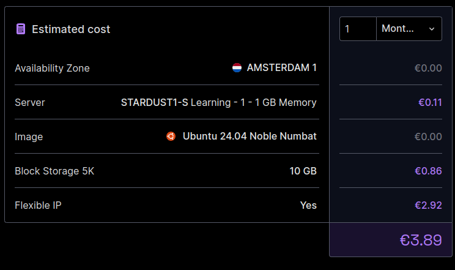

# Next.js Deployment and CI/CD Pipeline for VPC/Dedicated Servers

## Introduction

This repository was created as a response to the increasing costs of hosting Next.js applications on Vercel, where it now costs around €20 per developer to push code. With this method, the only cost incurred is the price of the server where the application is hosted, since GitHub provides a free tier of 2,000 minutes of CI/CD pipeline runtime, which is more than enough to deploy these types of applications. For more information, you can visit GitHub's pricing page: [GitHub Pricing](https://github.com/pricing).

As for hosting, Scaleway offers the best price-to-performance ratio for virtual and dedicated servers on the market. You can get a virtual server with SSH access for just €4 per month, which includes a public IP, making it an excellent alternative for deploying your code following the steps in this repository. You can find more details about Scaleway's pricing here: [Scaleway Pricing](https://www.scaleway.com/en/virtual-instances/) .




## What's included in this repository
This repository contains everything needed to set up and deploy your Next.js application in a custom environment. Below are the key components provided:

### 1. Ansible Playbooks for Server Setup
The repository includes Ansible playbooks in the **ansible** folder, that will automate the installation of all necessary dependencies on the target server. This includes tools like Docker, Docker Compose, and other essential packages. The playbooks are designed to prepare the server so that it is ready to host your Next.js application.

### 2. GitHub Actions Pipelines
Under the **.github** directory, you will find predefined CI/CD pipelines for three different environments:

- Development (dev)
- Pre-production (pre)
- Production (prod)

Each environment has its own pipeline, allowing you to push changes to the corresponding branch and trigger a deployment to a specific server. This allows seamless deployment across multiple environments with ease.

### 3. Dockerfile for Containerized Builds
This repository includes a Dockerfile that you can use to build your project anywhere, whether locally or via the pipeline. The Dockerfile sets up the environment to run your Next.js app, allowing you to easily manage the build and runtime environments.

### 4. Project Directory
The **project** directory contains an example Next.js project, which you can either use as a starting point or replace with your own project. You can upload your own Next.js application here, and the deployment pipeline will handle the rest.

By using this method, you can significantly reduce your hosting and deployment costs, as GitHub's free CI/CD minutes combined with Scaleway's affordable server pricing provide an efficient, cost-effective way to deploy your Next.js applications without breaking the bank.


# Prerequisites
Before running this repository, you need to set up a few things to ensure everything works smoothly. Follow these steps to get started:

### 1. Create an Account on Scaleway
If you're using Scaleway (though you can use any other cloud provider), follow these steps to create and configure your server:

#### 1.1 Create and upload your SSH key:

- First, you need to create an SSH key pair (public and private keys) that will be added to your Scaleway instance for remote access via SSH. Here's a guide to creating an SSH key: How to create an SSH key.
After generating the key, you need to upload the public key to Scaleway. You can follow this guide for instructions: How to upload an SSH key.
#### 1.2 Create a Scaleway instance:

- To host your Next.js application, create a STARDUST1S instance (or a higher tier if preferred) with Ubuntu 24.04 or newer. You can do this via the Scaleway console: Create instance.
This instance will cost €4 per month, which includes a public IP address, making it highly cost-effective.

#### 1.3 Configure the DNS settings:
To configure the DNS settings, you need to follow these steps:

##### - Log in to your domain registrar's website and navigate to the DNS management section.
##### - Create a new DNS record for your subdomain (e.g., dev.yourdomain.com) and set the record type to "A" (IPv4 address).
##### - Enter the public IP address of your Scaleway instance in the "Value" field.
##### - Save the DNS record and wait for the changes to propagate, which usually takes a few minutes to a few hours depending on your DNS provider.

Once the DNS settings are configured, you will be able to access your Next.js application using the subdomain you specified. Make sure to update the `DEV_IP`, `PRE_IP`, and `PROD_IP` secrets in the GitHub repository settings with the corresponding IP addresses of your servers.

### 2. Set Up GitHub
- You will need a GitHub account and access to the repository. Follow these steps to configure your GitHub and set up the secrets for the CI/CD pipeline:

#### 2.1 Create a GitHub token:
- A GitHub token is required for performing actions such as pulling the repository in the deployment process. You can generate a token here: Create GitHub token.

#### 2.2 Fork this repository:
- Fork this repository into your own GitHub account. This will allow you to modify the project according to your needs.

#### 2.3 Create GitHub secrets:

- Go to the Settings (https://github.com/string-in-video/nextjs-opensjource/settings/secrets/actions) of your forked repository and add the following secrets, which are required for the pipeline to work properly:
- **TOKEN_GITHUB**: Your GitHub token for pulling the repository. https://github.com/settings/tokens

- **DEV_IP**: IP address of the server where the application will be deployed in the development environment.

- **PRE_IP**: IP address of the server where the application will be deployed in the pre-production environment.

- **PROD_IP**: IP address of the server where the application will be deployed in the production environment.

- **SSH_PRIVATE_KEY**: The private key used to access the remote server via SSH. You can generate a new SSH key by running the following command:
```
ssh-keygen
```
- **DOCKER_REGISTRY**: Something like "rg.fr-par.scw.cloud/yourproject" (for example, Scaleway's container registry).

- **DOCKER_USERNAME**: Your Docker registry username (e.g., nologin).

- **DOCKER_PASSWORD**: Your Docker registry password.

- **DOCKER_IMAGE**: The name of the Docker image (e.g., front-test).

### 3. Install Ansible Locally
Ansible is required to automate the setup and configuration of your remote server. Install Ansible by following the official guide here: Ansible Installation.

### 4. Check SSH Access to Your Server
Before proceeding, make sure you can connect to your Scaleway instance (or any other cloud provider) via SSH. You can do this using an SSH client like Putty or directly from your terminal. Here’s a guide on how to connect to your instance via SSH: Connect to an Instance.

### 5. Add Your Next.js Project
Finally, make sure you add your Next.js project inside the project directory of this repository. If you already have a project, you can replace the example project provided in the project directory with your own. Alternatively, you can fork the entire repository to your own GitHub account and modify the files according to your needs.


# Step 1: Running Ansible to Configure the Server
In this step, we will use **Ansible** to set up the server with all the required dependencies to run **Docker** and **Docker Compose**. Follow the steps below to configure and deploy the environment.

## 1.1 Edit the Ansible Variables for Your Environment
Go to the ``ansible/vars`` directory and open the YAML file corresponding to the environment where you want to deploy. For example, if you are deploying to production, open ``prod.yml``.

You will need to modify a few variables:

``domain_name``: Set this to your subdomain and domain name. For example, if you're working on production, it could be `cloudsolute.net`, or for a development environment, it might be `dev.cloudsolute.net`.

``docker_image_tag``: It’s recommended to leave this as is unless you have your own tag management logic.

`certbot_mail`: Enter your email address here. This will be used by Certbot to configure SSL certificates for HTTPS connections. Make sure to use an email you check regularly, as Certbot may notify you of important updates regarding your certificates.

`docker_image`: Set the name of the Docker image you will be building. You can change this without any issue, but remember that you will also need to update the `DOCKER_IMAGE` secret in GitHub Actions accordingly.

`docker_registry`: This should be the registry where your Docker images will be stored. For example, if you're using Scaleway, it might look like this: `"rg.fr-par.scw.cloud/cloudsolute"`.

## 1.2 Update the Server's Public IP
Next, go to the ansible directory and open the hosts- file corresponding to your environment (e.g., hosts-prod for production). Replace the placeholder YOUR_DEV_SERVER_IP with the public IP of your Scaleway server.

## 1.3 Modify and Encrypt the Vault File
The next step is to configure the sensitive data in `vault.yml`. This file contains private credentials and other sensitive information. You will need to edit it before encrypting it for security.

- If you’re using Scaleway’s Docker registry, set the username to nologin, and for the project name, replace yourproject with your actual project name.

- You can create the Scaleway token by following this guide: How to create a Scaleway token.

Once you have modified `vault.yml`, encrypt it using the following command:

```bash
ansible-vault encrypt vault.yml
```
Ansible will ask you to provide a password. Make sure to remember this password, as it won't be stored anywhere and will be required for future operations.

If you need to decrypt the file later to make changes, use the following command:

```bash
ansible-vault decrypt vault.yml
```

You will be prompted to enter the password you set earlier, and the file will be decrypted for editing.

## 1.4 Run the Ansible Playbook
Now that everything is configured, you are ready to run the Ansible playbook to set up your server.

Ensure you are in the `ansible` directory, and run the following command to deploy the application to production (or replace `prod` with your environment):

```bash
ansible-playbook -i hosts-prod --extra-vars "env=prod" --ask-vault-pass playbook.yml
```
This command will:

- Run the playbook playbook.yml for the production environment (env=prod).
- Use the hosts-prod file to connect to your server.
- Prompt you for the vault password you set earlier when encrypting vault.yml.

### Reminder
- Ensure to modify both the `hosts-` file and `env=` argument to match the environment you are deploying to (e.g., `hosts-dev` for development).

By completing this step, you will have successfully configured your server with Docker, Docker Compose, and any other necessary dependencies, ready for your Next.js application deployment.


## Now that the Instance is Ready
Once you have successfully set up the server with Docker and Docker Compose using Ansible, you're ready to start working on your project. From this point forward, the process is fully automated, and you can focus on development while the pipeline takes care of deployments.

### Workflow
1. Work on Your Project: Make any necessary changes or improvements to your Next.js project located in the project directory.

2. Push Changes to GitHub: After you’ve made your changes, simply push them to the relevant branch in your repository (e.g., dev, pre, or main for production).

3. CI/CD Pipeline Handles Deployment: The GitHub Actions pipeline, which is configured in this repository, will automatically:

    - Build your Next.js application using the Dockerfile.
    - Push the new Docker image to your specified Docker registry (e.g., Scaleway Container Registry).
    - Deploy the updated application to the appropriate environment (development, pre-production, or production) on the server you’ve set up.

This entire process is seamless and fully automated. As long as you follow the steps outlined earlier to configure the necessary secrets and server, you won’t need to manually handle deployment again.

### Enjoy the Benefits
- **Cost-Efficient**: You avoid the increasing costs of Vercel, as the only expenses are the server hosting fees (such as €4 per month for a Scaleway instance) and free GitHub Actions minutes for the pipeline (2,000 minutes per month for free).

- **Full Control**: You have full control over your infrastructure and deployments, giving you the flexibility to customize your environments and manage your application lifecycle.

- **Automated Workflow**: Thanks to Ansible for server setup and GitHub Actions for CI/CD, the entire workflow is streamlined and efficient.

Simply push your code and let the pipeline handle the rest!


## MIT License

Copyright (c) 2024 CloudSolute

Permission is hereby granted, free of charge, to any person obtaining a copy of this software and associated documentation files (the "Software"), to deal in the Software without restriction, including without limitation the rights to use, copy, modify, merge, publish, distribute, sublicense, and/or sell copies of the Software, and to permit persons to whom the Software is furnished to do so, subject to the following conditions:

The above copyright notice and this permission notice shall be included in all copies or substantial portions of the Software.

THE SOFTWARE IS PROVIDED "AS IS", WITHOUT WARRANTY OF ANY KIND, EXPRESS OR IMPLIED, INCLUDING BUT NOT LIMITED TO THE WARRANTIES OF MERCHANTABILITY, FITNESS FOR A PARTICULAR PURPOSE AND NONINFRINGEMENT. IN NO EVENT SHALL THE AUTHORS OR COPYRIGHT HOLDERS BE LIABLE FOR ANY CLAIM, DAMAGES OR OTHER LIABILITY, WHETHER IN AN ACTION OF CONTRACT, TORT OR OTHERWISE, ARISING FROM, OUT OF OR IN CONNECTION WITH THE SOFTWARE OR THE USE OR OTHER DEALINGS IN THE SOFTWARE.
